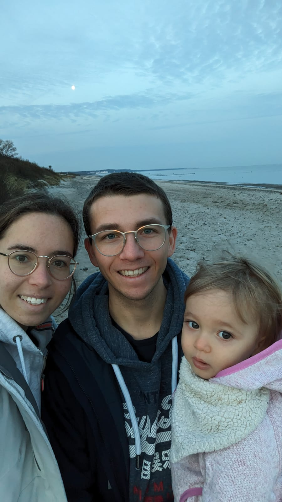

Hallo meine Lieblinge,

wenn ihr das lest, bin ich wohl schon im Hotel angekommen. Vermutlich haben wir auch schon Face-Chat gemacht!

Uns allen steht eine ungewohnte Situation bevor - eine Nacht, in der wir getrennt sind. Das wird uns sicher nicht leicht fallen. Aber morgen bin ich schon wieder da!

## Erinnerung

Vor dem Schlafengehen sollt ihr euch aber nochmal an einen tollen Tag erinnern!

Wo waren wir denn an diesem Tag unterwegs?

## Song für Mama

Wer, wenn nicht wir, schaffen alles zusammen - zum Beispiel die kommende Nacht getrennt zu verbringen?

<iframe width="560" height="315" src="https://www.youtube.com/embed/VbM7rnfmxic?si=c6HNLuRkt7yV03TC" title="YouTube video player" frameborder="0" allow="accelerometer; autoplay; clipboard-write; encrypted-media; gyroscope; picture-in-picture; web-share" referrerpolicy="strict-origin-when-cross-origin" allowfullscreen></iframe>

## Song für Edda

Habt ihr euch schon die Zähne geputzt? Falls nicht, stimmt euch schonmal ein!

<iframe width="560" height="315" src="https://www.youtube.com/embed/ObHnS_rfa_8?si=BVn7df1MsOeml0xY" title="YouTube video player" frameborder="0" allow="accelerometer; autoplay; clipboard-write; encrypted-media; gyroscope; picture-in-picture; web-share" referrerpolicy="strict-origin-when-cross-origin" allowfullscreen></iframe>

***

Ich wünsche euch eine gute Nacht. Ich denk an euch! Bis morgen früh, Papabär 🐻

PS: Das nächste Versteck ist: die unterste Schublade im Abstellraum oben!
